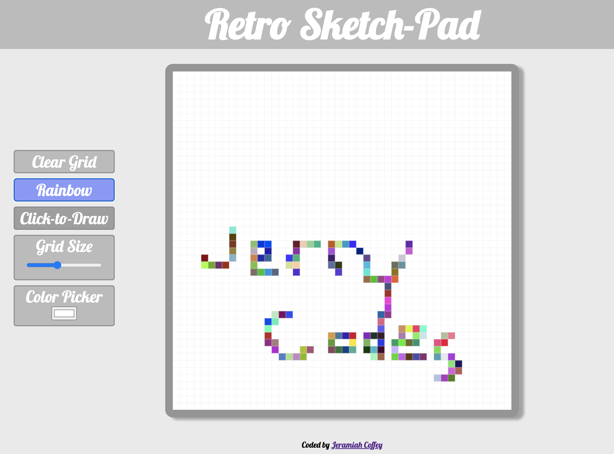

# Retro SketchPad

This project was built as a challenge for 'The Odin Project'. All code and designs are my own.

## Table of contents

- [Overview](#overview)
  - [The project](#the-project)
  - [Screenshot](#screenshot)
  - [Links](#links)
- [My process](#my-process)
  - [Built with](#built-with)
  - [What I learned](#what-i-learned)
  - [Continued development](#continued-development)
  - [Useful resources](#useful-resources)
- [Author](#author)

## Overview

### The project

This project is based on the Etch-a-Sketch toy orginally released in 1960. As you move your mouse around the grid, pixels are filled with a color of your choice.

-Similarly to the original toy, you can not begin drawing wherever you like. The pen is always "down".\
-The app allows you to choose a color to draw with.\
-Using the grid size selector, you can adjust the rows and columns to values between 16 and 100.\
-The clear button mimics the action of shaking an Etch-a-Sketch.

### Screenshot

### Links

- Public Repository: [Here](https://github.com/jeramiahgcoffey/etch-a-sketchpad)
- Live Site URL: [Here](https://jeramiahgcoffey.github.io/etch-a-sketchpad/)

## My process

### Built with

- Semantic HTML5 markup
- CSS custom properties
- Flexbox
- CSS Grid
- Mobile-first workflow

### What I learned
This project taught me a lot about DOM manipulation. Using JavaScript and CSS together, I was able to create a more interactive experience for the user. I learned about CSS custom properties, and how to update them via JavaScript, and I also solidified my basic knowledge of CSS Grid. Devloping this application has helped me realized my need to focus on further developing my styling techniques, and I plan to update this project as well as this ReadMe as my CSS skills improve.

I have gained an understanding of media queries, and the importance of a mobile-first approach. Although this project was built with a desktop-first approach, and is not yet responsive to touch input, it was very important to learn at this stage in my personal development.

### Continued development

I will continue working on my resonsive layout, and mobile-first design techniques.

### Useful resources

- [Mozilla Developer Network](https://developer.mozilla.org/en-US/docs/Web/CSS/CSS_Grid_Layout) - This is always my first go to when I am stuck and need some help with html, css, or js.
- [CSS Tricks](https://css-tricks.com/snippets/css/complete-guide-grid/) - A great resource for all things CSS

## Author

- Website - [Jeramiah Coffey](https://github.com/jeramiahgcoffey)
